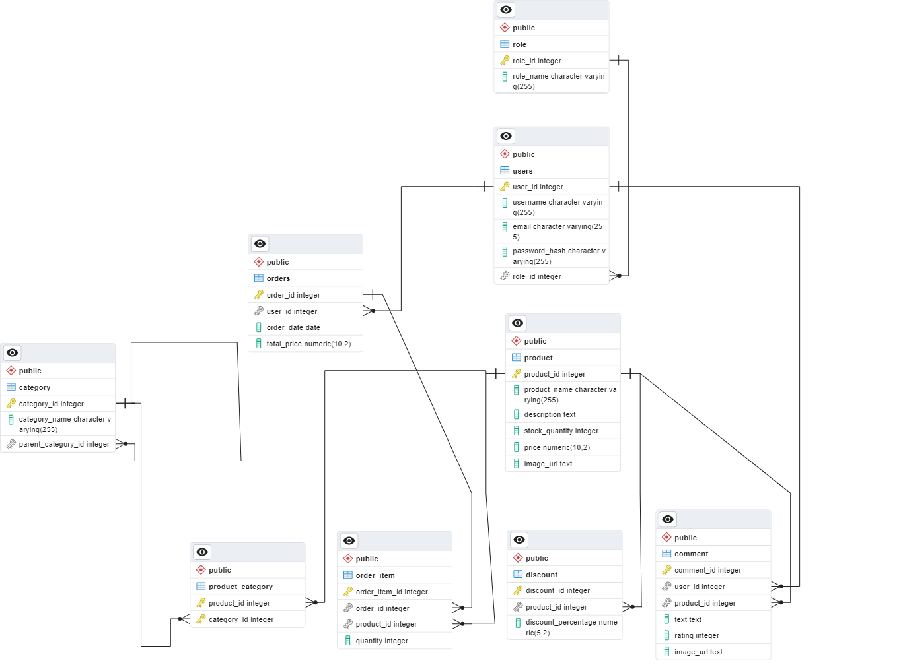

# Прототип интерен-магазина электроники
## Требования
1. Необходимо спроектировать модель данных и схему БД на основе описания функционала интернет-магазина. 
   Желательно отобразить спроектированную модель данных на соответствующей диаграмме. 
2. Реализовать 4 веб-страницы интернет-магазина, описанные выше. 
   Предпочтительно использовать Vue.js или другую современную frontend технологию. 
   Общение с серверной частью через HTTP API, которое должно быть Stateless. 
3. Серверная часть должна быть написана с использованием Java 8. 
4. Использовать JWT токен для авторизации/аутентификации. 
5. Использовать Spring 5 как базовый application framework. 
6. Взаимодействие с БД с помощью JPA (провайдер - Hibernate). СУБД – PostgreSQL. 
7. Необходимо обогатить базу данных продуктами/категориями/ценами/остатками и т.п., 
   чтобы на сайте были как минимум товары, представленные в описании задачи. 
8. Поля в карточках должны валидироваться в соответствии с форматами данных, установленными в БД. 
9. Исходные коды должны быть в Git. Желательно делать частые информативные коммиты, активно использовать ветки. 
10. Развертывание приложения – в Docker-контейнер. 
11. Должен быть описан порядок развертывания и запуска проекта в среде разработки 
    (включая настройку БД, дамп схемы БД, настройку сервера приложения для запуска и т.д.). 
12. Сервисы (серверная часть) должны быть максимально покрыты модульными тестами.

## Инструкция по развертыванию сервисов
### 1) Установка Docker
Для успешного развертывания сервисов необходимо установить Docker на вашей машине.(https://ru.wikipedia.org/wiki/Docker).
Если у вас его ещё нет, следуйте инструкциям для вашей операционной системы:

* Linux: (https://docs.docker.com/desktop/install/linux-install/)
* Windows: (https://docs.docker.com/desktop/install/windows-install/)
* Mac: (https://docs.docker.com/desktop/install/mac-install/)

### 2) Запуск сервисов
1) Склонируйте репозиторий, выполнив команду: `git clone https://github.com/Luthineth/electronics_online_shop.git`.
2) Перейдите в корневую директорию проекта: `cd electronics_online_shop`.
3) Запустите сервисы с помощью Docker Compose: `docker-compose up --build`.

После развертывания, приложение будет доступно по адресу: http://localhost:8081/.
1) Для проверки статуса запущенных контейнеров, выполните команду: `docker ps -a`.
2) Если требуется просмотреть логи конкретного контейнера, используйте команду: `docker logs <container_name_or_id>`.

## Структура приложения 
1) db (PostgreSQL):
   Описание: База данных PostgreSQL.
   Используемый образ: postgres:14.7 с DockerHub.
   Схема: Создает базу данных с именем online_store_db.
   Порт: Экспортирует порт 5432 для внешнего доступа.
2) backend:
   Описание: Java-проект, написанный на Java 8 с использованием Spring 5.
   Используемый образ: openjdk:8.
   Сборка: Копирует исходный код проекта в контейнер, собирает его с использованием Maven, и запускает JAR-файл.
   Зависимость: Зависит от контейнеров dn,minio,createbucket.
   Порт: Экспортирует порт 8080 для внешнего доступа.
3) frontend:
   Описание: Проект на JS и Vue.js.
   Используемый образ: node:lts-alpine.
   Сборка: Устанавливает зависимости npm и запускает приложение Vue.js.
   Зависимость: Зависит от контейнера backend.
   Порт: Экспортирует порт 5173 для внешнего доступа.
4) minio:
   Описание: Хранилище данных MinIO.
   Используемый образ: minio/minio:latest.
   Порты:
   9090 - Консоль MinIO.
   9000 - API MinIO.
   Хранилище: Использует том minio-data для хранения данных.
5) createbucket:
   Описание: Инструмент командной строки MinIO для создания бакетов.
   Используемый образ: minio/mc.
   Зависимость: Зависит от контейнера minio.
   Действие: Конфигурирует и создает бакеты в MinIO.

## Архитектура базы данных
1) Дамб [Дамб](https://github.com/Luthineth/electronics_online_shop/blob/main/Online-Store/src/main/resources/db/01_model.sql).
2) Схема 

## Тесты бекенд части
1) Перейдите в директорию проекта: `cd Online-Store`.
2) Выполнить следующую команду в корневой директории вашего проекта: `mvn test`